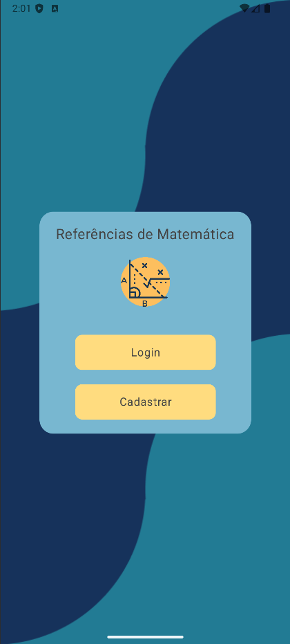

<!-- Usei este modelo como base de edição: https://github.com/othneildrew/Best-README-Template -->
<a id="readme-top"></a>
<!--
*** Caso queira mudar qualquercoisa aqui, pode enviar seu 
*** commit alterando o que deseja :D
-->

<!-- PROJECT LOGO -->
<br />
<div align="center">
  
  
  <h2 align="center">Atividades PROA</h2>

  <p align="center">
    Este repositório representa as atividades que desenvolvi enquanto estava estudando no proa!
    <br/>
  </p>
</div>
<!-- END: PROJECT LOGO -->

<!-- Tabela de resumo -->
<details>
  <summary>Atividades</summary>
  <ol>
    <!-- Primeiro: Sobre -->
    <li>
      <a href="#sobre-o-proa">Sobre o Proa</a>
    </li>
    <!-- Segundo: Descrição (com sublista) -->
    <li>
      <a href="#descrição-do-projeto">Descrição</a>
      <ul>
        <li><a href="#funcionalidades">Funcionalidades</a></li>
      </ul>
    </li>
    <!-- Terceiro: Tecnologias Usadas -->
    <li>
      <a href="#tecnologias-utilizadas">Tecnologias Utilizadas</a>
    </li>
    <!-- Quarto: Como executar o projeto -->
    <li>
      <a href="#como-executar-o-projeto">Como Executar o Projeto</a>
    </li>
    <!-- Quinto: Capturas de tela -->
    <li>
      <a href="#capturas-de-tela">Capturas de tela</a>
    </li>
    <!-- Sexto: Desafios -->
    <li>
      <a href="#desafios-implementados">Desafios Implementados</a>
    </li>
    <!-- Sétimo: Futuras Melhorias -->
    <li>
      <a href="#futuras-melhorias">Futuras Melhorias</a>
    </li>
    <!-- Oitavo: Licença -->
    <li>
      <a href="#licença">Licença</a>
    </li>
  </ol>
</details>
<!-- END: Tabela de resumo -->

<!-- SOBRE O PROA -->
## Sobre o Proa
<a id="#sobre-o-proa"></a>
O Instituto PROA nasceu em 2007 com o objetivo de capacitar e inserir jovens de baixa renda, vindos de escolas públicas, no mercado de trabalho. Por meio de desenvolvimento pessoal e profissional, o PROA já impactou mais de 70 mil jovens e hoje atua em 11 Estados: SP, RJ, MG, SC, RS, PR, PE, BA, GO, DF e MS com dois projetos: o PROPROFISSÃO e a Plataforma PROA.
</br>
<a href="https://www.proa.org.br">Instituto Proa</a>

<p align="right">(<a href="#readme-top">voltar ao topo</a>)</p>

<!-- Descrição de projeto -->
## Descrição de projeto
<a id="#desc"></a>
Desafio de lógica e programação, onde o principal objetivo é criar um aplicativo prático sobre geometria, onde possuem algumas formas básicas, tanto 2D quanto 3D, e suas formulas geométricas mais comuns.

<!-- Funcionalidades -->
#### Funcionalidades

- **Formulas para formas 2D:** Quadrado, Retângulo e Circulo
- **Formulas para formas 3D:** Cubo, Paralelepipedo e Esfera

<!-- END: Funcionalidades -->

<p align="right">(<a href="#readme-top">voltar ao topo</a>)</p>
<!-- END: Descrição de projeto -->

<!-- Tecnologias -->
## Tecnologias Utilizadas
[](https://skillicons.dev)

<p align="right">(<a href="#readme-top">voltar ao topo</a>)</p>
<!-- END: Tecnologias -->

<!-- Como Executar o Projeto -->
## Como Executar o Projeto
### Pré-requisitos
- Android Studio
- JDK 21+

### Instalação
1. Clone o repositório ```git clone https://github.com/MalcolnLMR/math-reference-android-app.git```
2. Abra com o android studio (espera o gradle fazer seu trabalho)
3. Execute rode o emulador (pode ser que seja necessário criar um, caso seja sua primeira vez com o android studio para isso siga o [Guia de instalação](https://developer.android.com/studio/run/managing-avds?hl=pt-br))

<p align="right">(<a href="#readme-top">voltar ao topo</a>)</p>
<!-- END: Como Executar o Projeto -->

<!-- Capturas de tela -->
## Capturas de tela
<div align="center">
  
  
  
</div>
<div align="center">
</div>
<div align="center">
</div>

<p align="right">(<a href="#readme-top">voltar ao topo</a>)</p>
<!-- END: Capturas de tela -->

<!-- Desafios Implementados -->
## Desafios Implementados
- Parametrização de componentes, para reutilização (implementando o [DRY](https://en.wikipedia.org/wiki/Don%27t_repeat_yourself))

<p align="right">(<a href="#readme-top">voltar ao topo</a>)</p>
<!-- END: Desafios Implementados -->

<!-- Futuras Melhorias -->
## Futuras Melhorias
1. Adição de ícones
2. Adição de todos os tipos de triângulos
3. Adição de formas mais complexas
4. Formas geométricas 4D (parece legal o suficiente)
5. Login funcional :D

<p align="right">(<a href="#readme-top">voltar ao topo</a>)</p>
<!-- END: Futuras Melhorias -->

<!-- LICENSE -->
## Licença

Distrubuído através da licença MIT.</br>
O Termo de uso de dentro do aplicativo é únicamente ilustrativo.

<p align="right">(<a href="#readme-top">voltar ao topo</a>)</p>
<!-- END: LICENSE -->